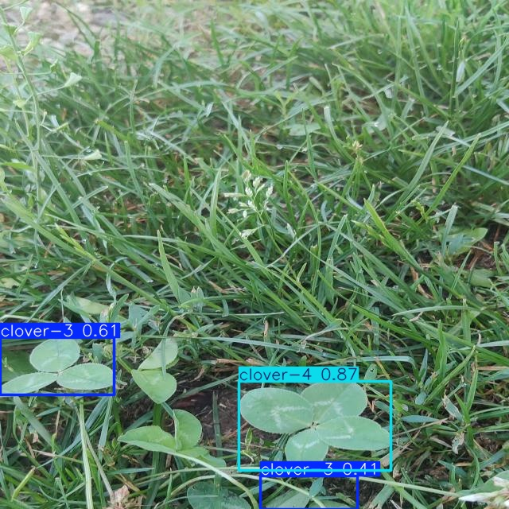
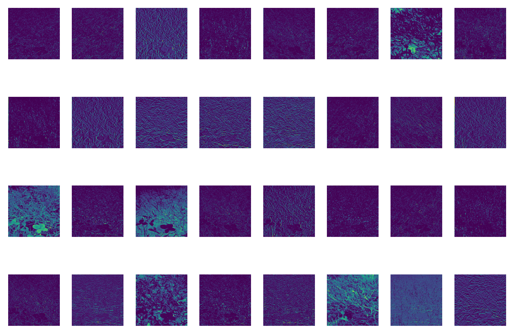

# Four-Leaf Clover Detector 🍀

**Real-time four-leaf clover detection using YOLOv8 and TensorFlow.js**

## Live Demo

🌐 **Try it now:** [https://christopherwoodall.github.io/four-leaf-yolo/](https://christopherwoodall.github.io/four-leaf-yolo/)

The demo runs entirely in your browser using your device's camera. Works on both desktop and mobile devices (optimized for Android Chrome and iOS Safari).

---

## About

This project trains a [YOLOv8](https://docs.ultralytics.com/models/yolov8/) model to detect three-leaf and four-leaf clovers in real-time, deployable directly in the browser with TensorFlow.js.


## Examples

### Detection Results


### Feature Visualization


## Browser Demo

The live demo at [https://christopherwoodall.github.io/four-leaf-yolo/](https://christopherwoodall.github.io/four-leaf-yolo/) is a self-contained browser application that:

- Runs YOLOv8n model entirely client-side using TensorFlow.js
- Uses your device camera for real-time detection
- Detects both three-leaf and four-leaf clovers
- Works on mobile (Android Chrome, iOS Safari) and desktop browsers
- Includes filter mode to show only four-leaf clovers

### Running the Demo Locally

```bash
# Serve the demo with proper MIME types for TensorFlow.js
fly-serve-demo --port 8080

# Or use Python's built-in server
python3 -m http.server 8080 --directory docs
```

Then open `http://localhost:8080` in your browser.

**Debug Mode:** Add `?debug=1` to the URL to enable visual debugging (shows colored outlines on mobile controls).

## Development Setup

### Dataset

Download the dataset from [Roboflow](https://universe.roboflow.com/adam-fonagy/hunting-for-four-leaf-clovers) and place it in the `data` directory.

### Installation

```bash
uv venv
source .venv/bin/activate  # On Windows: .venv\Scripts\activate
uv pip install -e .
# Optional: uv pip install -e ".[paddle]"
# Optional: uv pip install -e ".[tensorflow]"
```

### Training

Train a new YOLOv8 model on the clover dataset:

```bash
fly-train \
  --model weights/yolov8n.pt \
  --data data.yaml \
  --img 640 \
  --batch 16 \
  --epochs 50 \
  --device 0
```

### Benchmarking

Evaluate model performance:

```bash
fly-benchmark \
  --model weights/yolov8n-four-leaf.pt \
  --data data.yaml
```

### Inference

Run detection on images:

```bash
# Using ultralytics CLI
yolo detect predict \
  model=weights/yolov8n-four-leaf.pt \
  source=data/valid/images/IMG_20230720_092528_jpg.rf.980701a2b73a08ffa62ef76bdfb47d6e.jpg
```

**Tip:** More information on visualizing feature maps can be found [here](https://github.com/ultralytics/yolov5/issues/9395).

### Exporting for Web

Export the model to TensorFlow.js format for browser deployment:

```bash
# Export to ONNX first (if needed)
yolo export \
  model=weights/yolov8n-four-leaf.pt \
  format=onnx

# For TensorFlow.js, use the conversion pipeline in the project
# The pre-converted model is already in docs/model/
```

### Labeling Tools

For annotating additional training data:

```bash
# Install and start Label Studio
pip install label-studio
label-studio start
```

Navigate to `http://localhost:8080` and create a new project.


## Project Status

### Completed ✅
- [x] YOLOv8n model trained for clover detection
- [x] Browser demo with TensorFlow.js deployment
- [x] Mobile-optimized UI (Android Chrome & iOS Safari)
- [x] Real-time camera detection in browser
- [x] Filter mode for four-leaf clovers only
- [x] GitHub Pages deployment

### Roadmap 🚀
- [ ] Expand the dataset - see [FLC Dataset](https://biomedicalcomputervision.uniandes.edu.co/publications/finding-four-leaf-clovers-a-benchmark-for-fine-grained-object-localization/)
- [ ] Improve model accuracy with additional training data
- [ ] Add detection confidence scores to UI
- [ ] Performance optimizations for mobile devices
- [ ] PWA (Progressive Web App) support for offline use

## Technologies

- **Model**: YOLOv8n (Ultralytics)
- **Training**: PyTorch
- **Deployment**: TensorFlow.js
- **Frontend**: Vanilla JavaScript (ES6 modules)
- **Hosting**: GitHub Pages

## Credits

- Dataset: [Adam Fonagy on Roboflow](https://universe.roboflow.com/adam-fonagy/hunting-for-four-leaf-clovers)
- YOLOv8: [Ultralytics](https://docs.ultralytics.com/)
- TensorFlow.js conversion: Based on [yolov8-tfjs](https://github.com/Hyuto/yolov8-tfjs)

## License

See LICENSE file for details.
