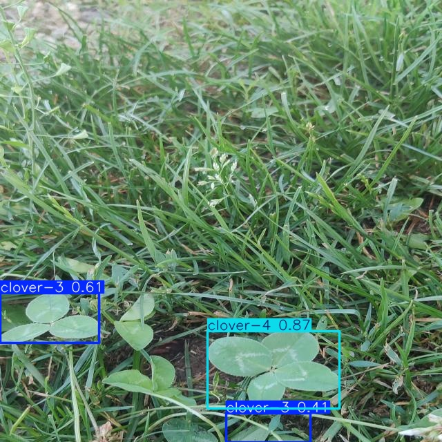

# 4 Leaf YOLO - WIP

Training [YOLO](https://docs.ultralytics.com/models/yolov8/#how-do-i-train-a-yolov8-model) to detect 4 leaf colvers in the browser.

## Example



## Usage

You will need to grab the dataset from Adam on Roboflow [here](https://universe.roboflow.com/adam-fonagy/hunting-for-four-leaf-clovers) and place it in the `data` directory.

### Installation

```bash
venv .venv
source .venv/bin/activate
pip install -e .
```

### Training

```bash
fly-train \
  --model weights/yolov8n.pt \
  --data data.yaml \
  --img 640 \
  --batch 16 \
  --epochs 50 \
  --device 0
```

### Benchmarking

```bash
fly-benchmark \
  --model weights/yolov8n-four-leaf.pt \
  --dataset data.yaml
```

### Object Detection

```bash
# Use ultralytics for now
yolo detect predict \
  model=weights/yolov8n-four-leaf.pt \
  source=data/valid/images/IMG_20230720_092528_jpg.rf.980701a2b73a08ffa62ef76bdfb47d6e.jpg
```


## To Do

- [ ] Expand the dataset - see [FLC Dataset](https://biomedicalcomputervision.uniandes.edu.co/publications/finding-four-leaf-clovers-a-benchmark-for-fine-grained-object-localization/).
- [ ] Quantize the model for use in the browser.
- [ ] Convert to ONNX/TensorFlow.
- [ ] [Serve with `tensorflow.js`](https://github.com/Hyuto/yolov8-tfjs)
