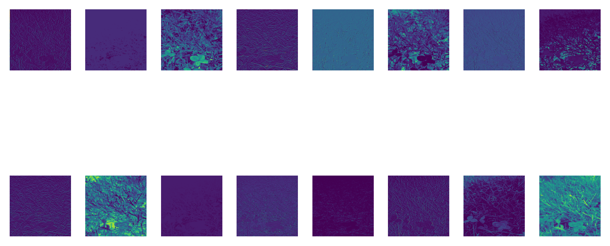

# 4 Leaf YOLO - WIP

Training YOLO to detect 4 leaf colvers in the browser.

## Examples



## Usage

You will need to grab the dataset from Adam on Roboflow [here](https://universe.roboflow.com/adam-fonagy/hunting-for-four-leaf-clovers) and place it in the `data` directory.

### Installation

```bash
venv .venv
source .venv/bin/activate
pip install -e .
```

### Training

```bash
fly-train
```

### Object Detection

```bash
fly-detect
```


## To Do

- [ ] Create a more robust dataset - see [FLC Dataset](https://biomedicalcomputervision.uniandes.edu.co/publications/finding-four-leaf-clovers-a-benchmark-for-fine-grained-object-localization/).
- [ ] Quantize the model for use in the browser.
- [ ] Convert to ONNX/TensorFlow
- [ ] [Serve with `tensorflow.js`](https://github.com/Hyuto/yolov8-tfjs)
